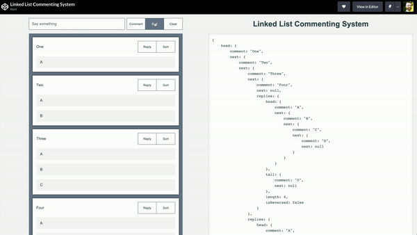
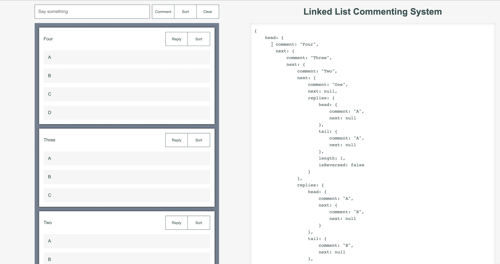
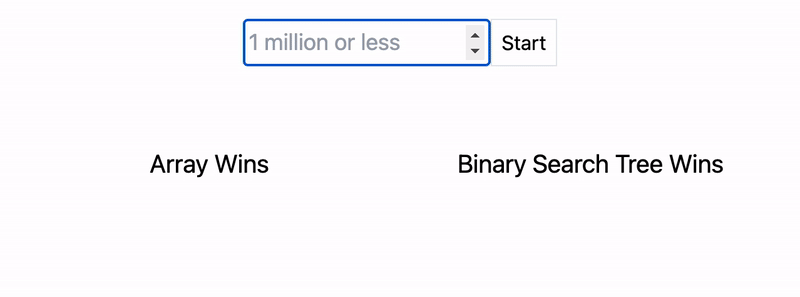

# TypeScript Data Structures and Algorithms

## Example Data Structures

 

### Linked List

Linked List Commenting System

- [GitHub](https://github.com/WarrenMfg/linked-list-commenting-system)

- [Codepen](https://codepen.io/kentagon/pen/abwoBdm)

 

### Stack

Call Stack Animation

- [Codepen](https://codepen.io/kentagon/pen/NWgKLyY)

 

### Queue

Message Queue

- [Codepen](https://codepen.io/kentagon/pen/wvewRjp)

 

### Binary Search Tree

Array vs BST

- [Codepen](https://codepen.io/kentagon/pen/XWgmGqm)

